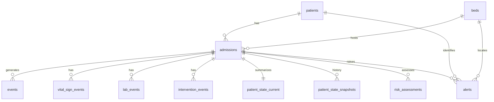

# ICU Agent 后端数据库使用规范

本文档约定正式项目中如何使用 PostgreSQL 中的 ICU 核心库：连接方式、命名规则、写入原则，以及各表用途与字段含义。  
**字段级 JSON 示例**仍以 [数据类型.md](./数据类型.md) 为准；**实际 DDL** 以 `local/system/backend/测试数据库/init_core_tables.py` 为准（迁移时应从该脚本或由其导出的 SQL 生成）。

---

## 1. 适用范围与目标读者

- **适用范围**：ICU 多智能体模拟系统的患者主数据、事件流、当前状态、风险与告警、审计日志。
- **读者**：后端开发、Agent 编排、数据分析脚本维护者。

本库为**教学与模拟**设计，不替代真实临床信息系统；任何面向真人的决策须有人类在环。

---

## 2. 技术栈与连接规范

| 项 | 约定 |
|----|------|
| 数据库 | PostgreSQL（建议 16+，与本地 Homebrew `postgresql@16` 对齐） |
| 默认库名（开发） | `icu_agent` |
| 时区 | 列类型为 `TIMESTAMPTZ`；应用层写入建议使用 **UTC** 或明确带偏移，避免歧义 |
| Python 驱动 | **psycopg 3**（包名 `psycopg`，建议安装 `psycopg[binary]`） |
| 解释器 | 团队内统一使用同一解释器安装依赖；`python` 与 `python3` 可能指向不同环境，以 `python -c "import psycopg"` 实测为准 |

**连接串（开发示例）**：

```text
dbname=icu_agent user=<系统用户名> host=localhost port=5432
```

**正式环境**：

- 密码、主机等通过环境变量或密钥管理注入，**禁止**将生产凭据写入仓库。
- 建议变量名示例：`ICU_PG_DSN` 或 `PGHOST` / `PGPORT` / `PGDATABASE` / `PGUSER` / `PGPASSWORD`。

---

## 3. Schema 与权威来源

- **逻辑模型**：`数据类型.md`（JSON 形态、业务语义）。
- **物理模型**：`init_core_tables.py` 中的 `CREATE TABLE`（含 `CHECK`、外键、`JSONB` 默认值）。
- **本地初始化脚本**（仅开发与联调）：
  - 建表：`local/system/backend/测试数据库/init_core_tables.py`
  - 种子数据：`local/system/backend/测试数据库/seed_test_data.py`
  - 验收：`local/system/backend/测试数据库/verify_db.py`
  - 浏览：`local/system/backend/测试数据库/view_all_tables.py`

正式项目迁移时，建议将 DDL 纳入 Alembic / Flyway 等版本化迁移，而不是仅依赖手工执行脚本。

---

## 4. 命名规范

| 类型 | 约定 | 示例 |
|------|------|------|
| 表名 | `snake_case`，复数语义 | `patients`, `vital_sign_events` |
| 主键列名 | 与实体一致：`patient_id`, `bed_id`, `admission_id`, `event_id`, `alert_id`；部分表用 `id` | `vital_sign_events.id` |
| 业务 ID 前缀（字符串主键） | 全系统可读、与任务书一致 | 病人 `p*`，床位 `b*`，住院 `adm*`，事件 `evt*`，生命体征 `vital*`，化验 `lab*`，干预 `intv*`，快照 `snap*`，风险 `risk*`，告警 `alert*`，审计 `log*` |
| 展示用编号 | 与内部 ID 分离 | `patient_code`（如 `P001`），`bed_code`（如 `ICU-01`），`admission_code`（如 `ADM-001`） |
| Agent / 服务标识 | 小写蛇形或约定枚举 | `risk_sentinel`, `ward_coordinator` |

---

## 5. 数据分层与写入原则

```
patients / beds          → 相对稳定的主数据
        ↓
admissions               → 一次 ICU 入住（可关联床位变更，当前模型为单 bed_id）
        ↓
events                   → 事件总线索引（轻量 payload + 类型）
vital_sign_events / lab_events / intervention_events  → 明细事实表（append-only 推荐）
        ↓
patient_state_current    → 当前聚合状态（按 admission 一行，upsert / 高频更新）
patient_state_snapshots  → 可选历史快照（append）
risk_assessments         → Agent 风险评估输出（append，保留历史）
alerts                   → 告警实例（可更新 status、last_seen_at）
audit_logs               → 审计（append-only）
```

**推荐约定**：

1. **事实类**（生命体征、化验、干预、`events` 中指向的明细）：以**追加插入**为主，不随意改历史行；纠错用新事件或审计说明。
2. **`patient_state_current`**：每次 Agent 或状态引擎跑完后 **UPSERT**（按 `admission_id`），保证「当前视图」只有一行 per admission。
3. **`events.payload`**：存引用或摘要（如 `{"vital_id": "vital1"}`），完整数值以对应明细表为准，避免双写不一致。
4. **外键**：写入时 `patient_id` / `bed_id` / `admission_id` 必须与 `admissions` 行一致（与 `admissions` 上登记的关系对齐）。

---

## 6. 实体关系（概要）



`audit_logs` 为横切表，通过 `target_type` + `target_id` 指向任意业务实体，无外键到具体表（便于扩展）。

---

## 7. 枚举与 CHECK 约束速查

以下为数据库层面已约束的取值（正式代码与 Agent 输出应对齐）。

| 表 / 列 | 允许值 |
|---------|--------|
| `patients.gender` | `male`, `female`, `other` |
| `beds.status` | `occupied`, `empty`, `cleaning`, `maintenance` |
| `admissions.status` | `active`, `discharged`, `expired`, `transferred` |
| `admissions.severity_on_admission` | `stable`, `unstable`, `critical` |
| `events.event_type` | `vital_sign`, `lab`, `intervention`, `agent_output` |
| `events.source` | `monitor`, `lab`, `nurse`, `agent` |
| `events.priority` | `low`, `normal`, `high`, `critical` |
| `intervention_events.intervention_type` | `fluid`, `vasopressor`, `ventilator_change` |
| `lab_events.abnormal_flag` | `normal`, `high`, `low` |
| `patient_state_current.care_phase` | `stable`, `unstable`, `critical` |
| `risk_assessments.severity` | `low`, `warning`, `critical` |
| `risk_assessments.confidence` | 0～1（`NUMERIC`） |
| `alerts.severity` | `info`, `warning`, `critical` |
| `alerts.status` | `open`, `acknowledged`, `closed` |
| `audit_logs.actor` | `agent`, `system`, `user` |
| `audit_logs.action_type` | `create_event`, `update_state`, `run_agent` |

未列入上表的文本字段（如 `risk_type`, `alert_type`, `lab_type`）由业务层约定枚举或自由文本，**新增类型时**建议同步更新本文档与 Agent 契约。

---

## 8. 各表说明

### 8.1 `patients`

| 用途 | 患者主数据，跨次住院不变。 |
| 主键 | `patient_id` |
| 主要列 | `patient_code`（展示）, `name`, `gender`, `age`, `date_of_birth`, `baseline_profile`（JSONB：合并症、过敏等）, `created_at`, `updated_at` |

### 8.2 `beds`

| 用途 | ICU 床位资源。 |
| 主键 | `bed_id` |
| 主要列 | `bed_code`, `room_code`, `bed_type`, `status`, `notes`, 时间戳 |

### 8.3 `admissions`

| 用途 | 单次 ICU 入住 episode；Agent 时序分析的主锚点。 |
| 主键 | `admission_id` |
| 外键 | `patient_id` → `patients`, `bed_id` → `beds` |
| 主要列 | `admission_code`, `admit_time`, `discharge_time`, `status`, `primary_diagnosis`, `admission_reason`, `severity_on_admission`, `attending_team`, `scenario_tag`（模拟场景标签，如 `sepsis_progressive`） |

### 8.4 `events`

| 用途 | **事件总线索引**：驱动 Agent 与前端时间线；`payload` 宜为引用或摘要。 |
| 主键 | `event_id` |
| 外键 | `admission_id`, `patient_id`, `bed_id` |
| 主要列 | `event_type`, `source`, `timestamp`, `priority`, `payload`（JSONB） |

### 8.5 `vital_sign_events`

| 用途 | 生命体征与血气相关测量；字段命名对齐 ICU / **APACHE II** 所需项。 |
| 主键 | `id` |
| 外键 | `admission_id` |
| 主要列 | `heart_rate`, `mean_arterial_pressure`, `systolic_bp`, `diastolic_bp`, `respiratory_rate`, `temperature`, `spo2`, `fio2`, `pao2`, `aado2`, `ph`, `gcs` |

说明：`fio2` 存 0～1；`pao2` / `aado2` 按血气场景二选一或并存；缺失列允许为 `NULL`。

### 8.6 `lab_events`

| 用途 | 实验室与可量化检验指标。 |
| 主键 | `id` |
| 外键 | `admission_id` |
| 主要列 | `lab_type`, `value`, `unit`, `abnormal_flag` |

### 8.7 `intervention_events`

| 用途 | 治疗与设备参数变更，支撑「干预—反应」闭环。 |
| 主键 | `id` |
| 外键 | `admission_id` |
| 主要列 | `intervention_type`, `description`, `dosage`, `unit`（后两者可选） |

### 8.8 `patient_state_current`

| 用途 | **当前住院**的聚合状态，供 Ward / Summary / Agent 快速读取。 |
| 主键 | `admission_id` |
| 外键 | `admission_id`, `patient_id`, `bed_id` |
| 主要列 | `current_vitals`, `active_problems`, `active_risks`, `latest_interventions`（均为 JSONB 数组或对象）, `care_phase`, `updated_at` |

### 8.9 `patient_state_snapshots`

| 用途 | 按需或定时落库的状态快照，用于回放与对比。 |
| 主键 | `id` |
| 外键 | `admission_id` |
| 主要列 | `timestamp`, `state_snapshot`（JSONB） |

### 8.10 `risk_assessments`

| 用途 | 风险 Agent 的结构化输出历史。 |
| 主键 | `id` |
| 外键 | `admission_id` |
| 主要列 | `risk_type`, `confidence`, `severity`, `evidence`（JSONB 数组）, `time_window`, `recommended_action` |

### 8.11 `alerts`

| 用途 | 面向医护或协调 Agent 的告警；可更新生命周期字段。 |
| 主键 | `alert_id` |
| 外键 | `admission_id`, `patient_id`, `bed_id` |
| 主要列 | `alert_type`, `severity`, `status`, `source_agent`, `evidence`, `first_seen_at`, `last_seen_at` |

### 8.12 `audit_logs`

| 用途 | 记录谁在何时对何对象做了什么，满足可追溯性。 |
| 主键 | `id` |
| 外键 | 无（松耦合） |
| 主要列 | `timestamp`, `actor`, `actor_id`, `action_type`, `target_type`, `target_id`, `input`, `output`（JSONB） |

---

## 9. JSONB 字段约定（建议）

| 字段 | 建议结构 |
|------|----------|
| `patients.baseline_profile` | `{ "comorbidities": [], "allergies": [] }`，可扩展键名与英文 snake_case |
| `patient_state_current.active_problems` | 字符串数组或对象数组（若用对象，需统一 schema） |
| `patient_state_current.active_risks` | 对象数组，如 `[{ "risk_type", "severity" }]` |
| `risk_assessments.evidence` | 对象数组，每项建议含 `metric`, `value`, 可选 `trend`, `ref_id` |
| `alerts.evidence` | 对象数组，可含 `risk_id`、指标摘要等 |
| `events.payload` | 轻量引用为主，如 `{ "vital_id": "vital1" }` |

---

## 10. 安全与合规（正式环境）

- 勿在仓库、日志、种子脚本中提交**真实患者标识**或真实诊疗数据。
- 生产库应配置访问控制、备份与恢复策略；审计表仅追加，定期归档策略由运维决定。
- Agent 输出仅为辅助信息，不自动执行临床决策；重要写入建议同时打 `audit_logs`。

---

## 11. 统一 HTTP API（FastAPI）

正式联调时，**模拟器、前端、Agent** 应通过后端 API 访问数据，避免直连 PostgreSQL。

- **代码目录**：`local/system/backend/api/`
- **依赖**：`pip install -r requirements.txt`（若遇 SSL 校验问题，可对 PyPI 使用 `--trusted-host`）
- **环境变量**：`ICU_PG_DSN`（默认 `dbname=icu_agent user=<本机用户> host=localhost port=5432`）
- **启动**：在 `api` 目录下执行  
  `uvicorn app.main:app --reload --host 0.0.0.0 --port 8000`  
- **交互文档**：`http://127.0.0.1:8000/docs`

**核心路由（v1）**：

| 方法 | 路径 | 说明 |
|------|------|------|
| POST | `/api/v1/admissions/{admission_id}/events/vital_sign` | 写入生命体征明细 + `events` + 更新 `patient_state_current` + `audit_logs` |
| POST | `/api/v1/admissions/{admission_id}/events/lab` | 同上（化验） |
| POST | `/api/v1/admissions/{admission_id}/events/intervention` | 同上（干预） |
| GET | `/api/v1/admissions/{admission_id}/state/current` | 读取当前聚合状态 |
| GET | `/api/v1/admissions/{admission_id}/alerts` | 查询该住院下告警列表 |
| GET | `/api/v1/admissions/{admission_id}/risks` | 查询该住院下风险评估列表 |
| GET | `/health` | 健康检查 |

写入流程在服务端事务内完成：**校验住院存在且 `active` → 写明细表 → 写 `events` → UPSERT `patient_state_current` → 写两条审计（`create_event` + `update_state`）**。

---

## 12. 相关文档与脚本索引

| 资源 | 路径 |
|------|------|
| JSON 字段示例 | `local/system/backend/数据规范/数据类型.md` |
| DDL 源码 | `local/system/backend/测试数据库/init_core_tables.py` |
| 本地说明与命令 | `local/system/backend/测试数据库/测试数据库.md` |
| HTTP API | `local/system/backend/api/` |

---

*文档版本：与当前 `init_core_tables.py` 中 12 张核心表一致；表结构变更时请同步更新本文件与迁移脚本。*
